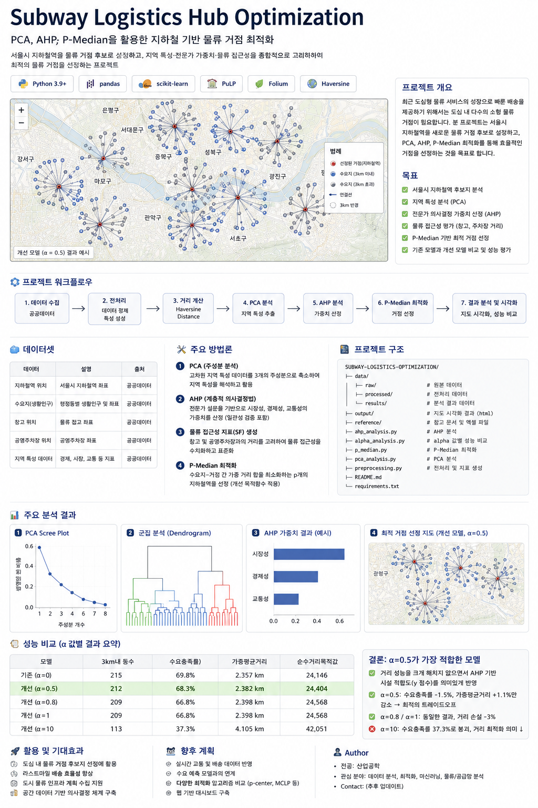

# subway-logistics-optimization - 서울시 공공배달 거점 최적 입지 선정



P-Median 모델을 활용하여 서울시 내 공공배달 거점(지하철역)의 최적 입지를 선정하는 프로젝트입니다.

## 프로젝트 구조

```
├── preprocessing.py   # 데이터 전처리 (창고·주차장 거리 기반 SF 산출)
├── pca_analysis.py    # PCA 및 계층적 군집 분석
├── ahp_analysis.py    # AHP 분석으로 시설 입지 점수(y) 산출
├── p-median.py        # P-Median 최적화 및 지도 시각화
├── alpha_analysis.py  # 알파값별 성능 비교 분석
├── data/              # 입력 데이터
└── output/            # 시각화 결과 (HTML 지도)
```

## 분석 흐름

1. **전처리** (`preprocessing.py`) - 지하철역별 창고·주차장 접근성 지표(SF) 계산
2. **PCA·군집화** (`pca_analysis.py`) - 지하철역 특성 데이터 차원 축소 및 군집 분석
3. **AHP 분석** (`ahp_analysis.py`) - 다기준 의사결정으로 시설 적합도 점수(y) 산출
4. **P-Median 최적화** (`p-median.py`) - 수요 가중 거리 최소화 + y 점수 반영(α)으로 최적 10개 거점 선정
5. **알파 분석** (`alpha_analysis.py`) - α 값에 따른 수요충족률·가중평균거리 비교

## 설치 및 실행

```bash
pip install -r requirements.txt
python p-median.py
```

## 주요 결과 (p=10)

### α값별 성능 비교

| 모델 | 3km 내 동수 | 수요충족률 | 가중평균거리 | 순수거리목적값 |
|------|------------|-----------|------------|--------------|
| 기존 (α=0) | 215 | 69.8% | 2.357km | 24,146 |
| 개선 α=0.5 | 212 | 68.3% | 2.390km | 24,482 |
| 개선 α=0.8 | 210 | 68.2% | 2.419km | 24,785 |
| 개선 α=1   | 210 | 68.2% | 2.419km | 24,785 |
| 개선 α=10  | 113 | 37.3% | 4.136km | 42,369 |

### 권장 α값: 0.5

- 수요충족률 -1.5%, 가중평균거리 +1.4%의 소폭 감소로 시설 입지 적합도(y)를 반영
- α=0.8·1은 동일한 결과를 산출하며 거리 손실이 -1.6%p 더 큼
- α=10은 y점수에 편중되어 수요충족률이 37.3%로 급락
